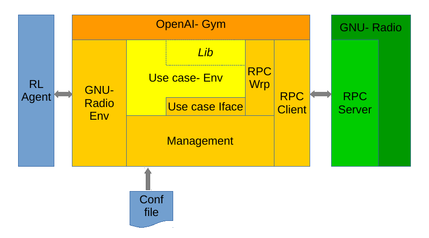

### Goals of the project
Your task is to integrate GNURadio as an environment for OpenAI Gym. Specifically, it should become
possible to expose the state and control the behaviour of GNURadio protocol implementations for an
ML/RL agent’s learning purposes. The framework to be developed should be generic so that it can be
used in various networking problems. As a proof-of-concept you should implement a showcase using
the IEEE 802.11p implementation in GNURadio 3 where an RL agent learns to control the transmit
power and/or MCS selection. 

